<div align="center">


# filebrowser pretty

[](#)
[](#)
[](#)
[](#)
[](LICENSE)

</div>

<p align="center">
  
</p>

---

## Features

**Browsing & navigation**

- List, grid, and gallery views — remembered per folder
- Command palette (⌘K) with instant file search and quick actions
- Search-as-you-type, including tag and file-type filters
- Recents and favorites in the sidebar
- Multi-column sort — name, size, modified, or extension
- Breadcrumb navigation with depth ellipsis and sibling-folder jump
- Smooth scrolling in folders with tens of thousands of files

**Files**

- Create, rename, move, copy, and delete inline — delete is undoable
- Right-click context menus on files and empty space
- Bulk rename with pattern or find-and-replace and a live preview
- Drag and drop — into folders, up via breadcrumbs, and rubber-band select
- Spring-loaded folders that open on hover while dragging
- Extract zip archives, optionally removing the original
- Copy a file's path to the clipboard

**Tags & smart folders**

- Color-coded tags with inline chips and a picker
- Smart folders — saved searches over tags, type, and name
- Tags follow files through renames and moves

**Uploads**

- Drag-and-drop, file, and folder uploads
- Resumable — uploads survive a dropped connection
- Floating dock with per-file progress, cancel, and queueing
- Photo and camera-roll upload on mobile

**Previews**

- Images — zoom, fit, film strip, EXIF, and rotate / flip / crop editing
- Video — playback, thumbnails, subtitle upload, picture-in-picture, track info
- Audio — playback with album art, ID3 tags, and previous/next track
- PDF — rendered pages, navigation, zoom, and text search
- EPUB — reader with chapter list and remembered position
- Text and Markdown — rendered or raw, with an inline editor
- CSV tables

**Sharing**

- Public links with optional password and expiration periods
- Share management page

**Mobile**

- Responsive on every screen, with a slide-out sidebar
- Pull-to-refresh, and swipe between files in the preview

**Appearance**

- Light, dark, and system themes, per user
- Six-preset accent color
- Per-account language and code-editor theme

**Admin & integrations**

- User management and global settings
- Audit log — every file op, share, sign-in, and setting change, filterable
- Webhooks — POST to your services on file changes, with test and retry
- Sign out of every other session at once

**Reliability**

- Loads and runs offline, with a clear offline indicator
- Named error states with one-click retry
- Full keyboard shortcuts with a built-in cheat sheet (press `?`)

---

## Screenshots

<!--
  Capture guide — drop PNGs into docs/screenshots/ (filenames below). Several
  are placeholders for shots not yet taken.

  • Default theme on (subtle gradient + translucent surfaces) so the signature
    look shows; include the dark shots in the Light & dark table.
  • Consistent 1440×900 desktop window; real device frame for the mobile trio.
  • Seed a demo account with real photos, a video, an audio file with embedded
    art, an EPUB with a cover, and a few tagged + favorited folders.
  • Capture at 2× so images stay crisp when scaled.
  • Must-haves if trimming: hero, the Light & dark table, gallery, command
    palette, the preview grid, bulk-select, and settings-profile.
-->

### Browse

<p align="center">
  
  <br/><em>List view — colorful file-type tiles, inline tags, and the green sort indicator</em>
</p>

<p align="center">
  
  
  <br/><em>Grid and gallery views</em>
</p>

<p align="center">
  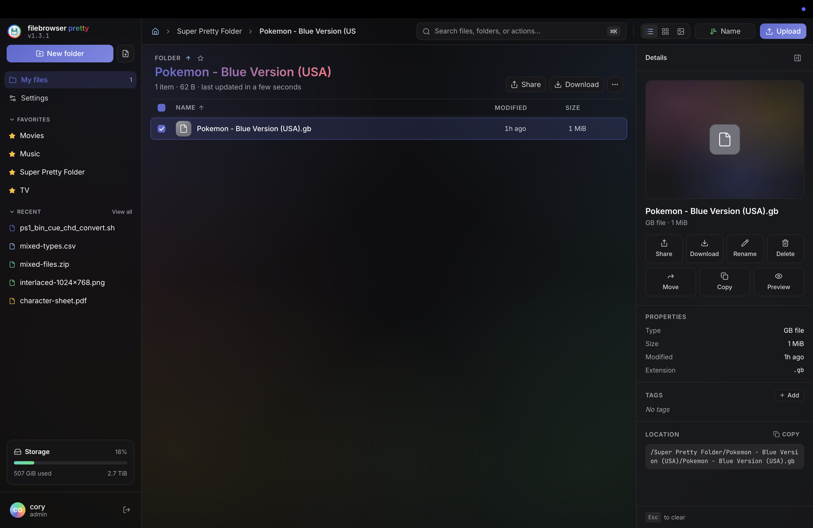
  <br/><em>The signature accent-gradient background — configurable off / whisper / subtle / bold</em>
</p>

### Light &amp; dark

<table>
  <tr>
    <th align="center" width="50%">Light theme</th>
    <th align="center" width="50%">Dark theme</th>
  </tr>
  <tr>
    <td></td>
    <td></td>
  </tr>
  <tr>
    <td></td>
    <td></td>
  </tr>
</table>

### Search &amp; navigate

<p align="center">
  
  <br/><em>⌘K command palette — instant file search, quick actions, color-coded icons</em>
</p>

<p align="center">
  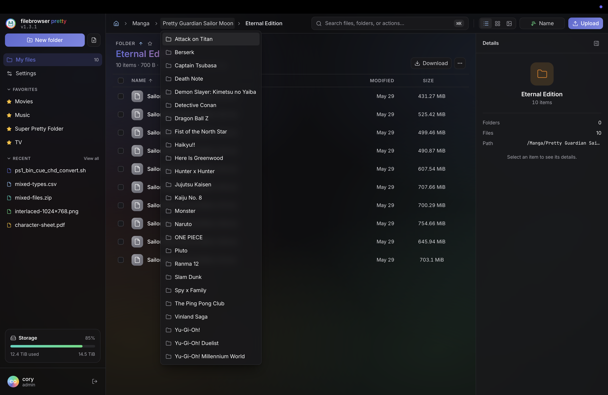
  <br/><em>Breadcrumbs with depth ellipsis and a sibling-folder jump dropdown</em>
</p>

### Previews

<p align="center">
  
  <br/><em>Image preview — film strip, fit / zoom, and EXIF camera data</em>
</p>

<p align="center">
  
  
  <br/><em>Video playback with track info · audio with album art and ID3 tags</em>
</p>

<p align="center">
  
  
  <br/><em>PDF reader · EPUB reader with chapter list and remembered position</em>
</p>

<p align="center">
  
  <br/><em>Rendered Markdown (toggle to raw) and the themed in-browser editor</em>
</p>

### Power features

<p align="center">
  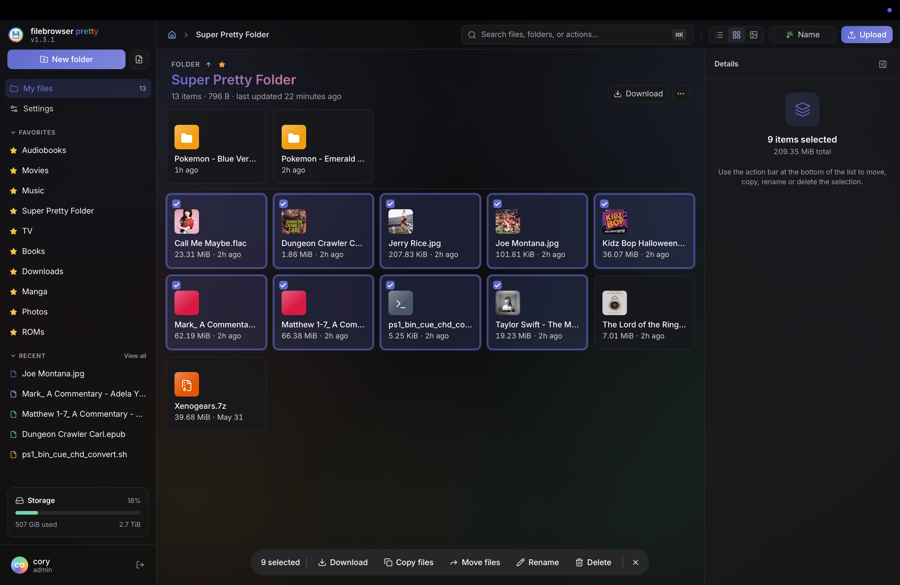
  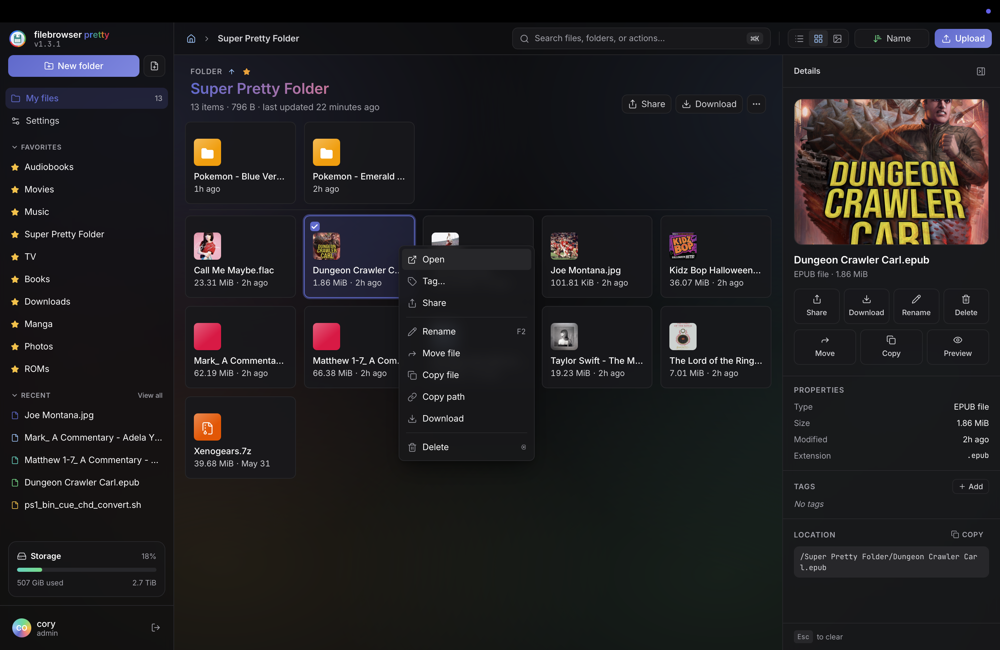
  <br/><em>Multi-select bulk actions · right-click context menus</em>
</p>

<p align="center">
  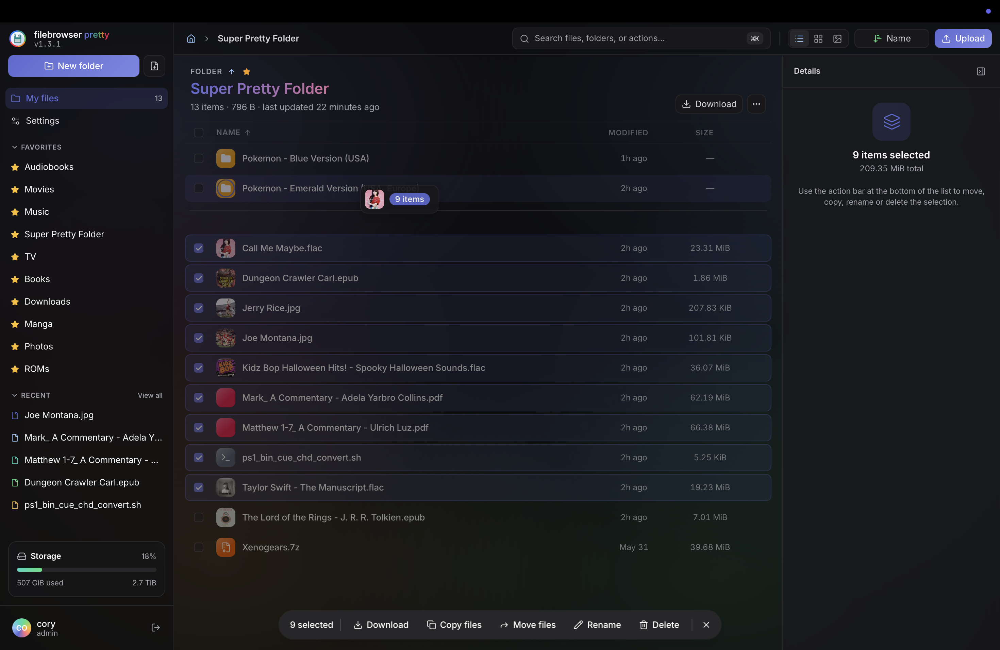
  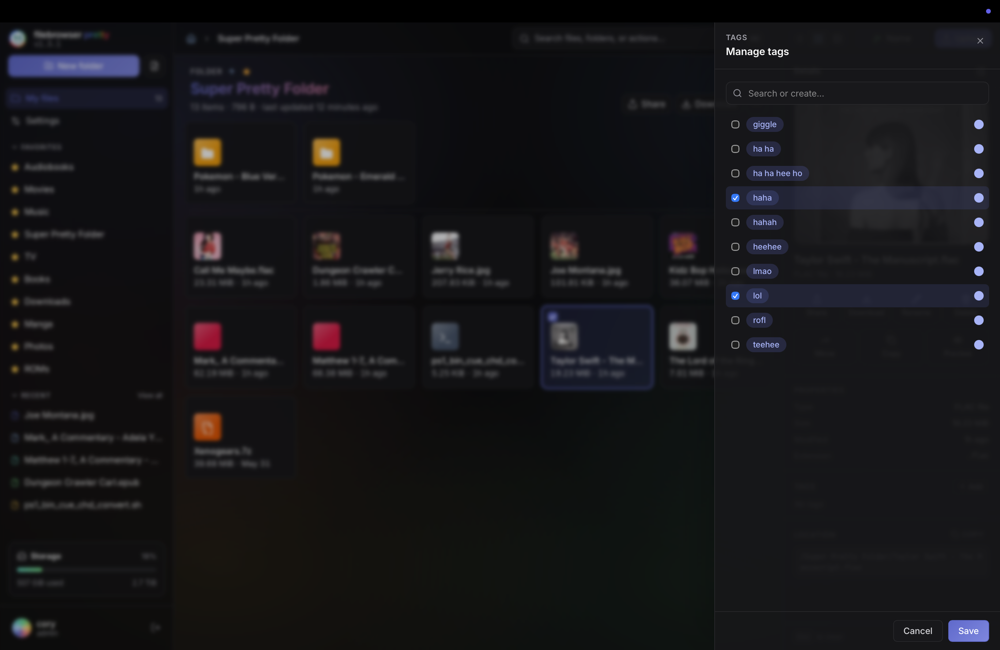
  <br/><em>Drag and drop with spring-loaded folders · color-coded tags</em>
</p>

<p align="center">
  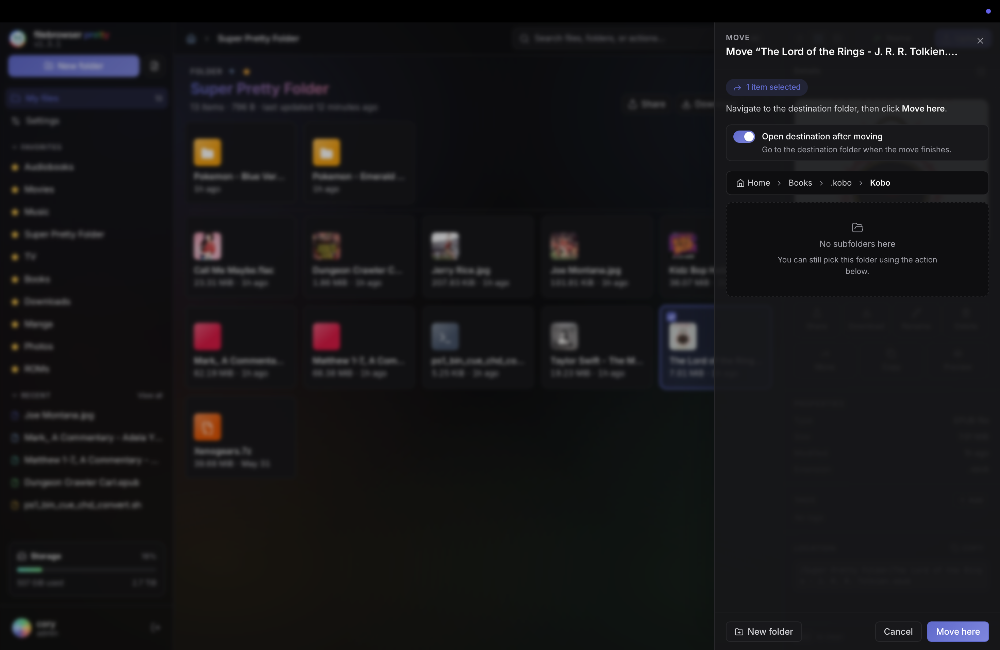
  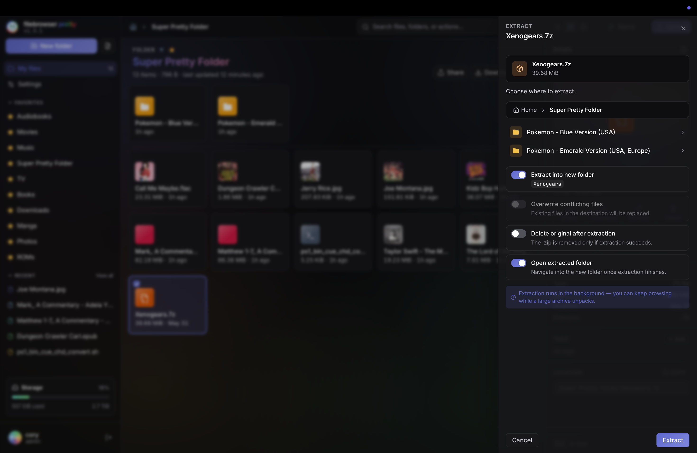
  <br/><em>Move / copy folder picker · archive extraction</em>
</p>

<p align="center">
  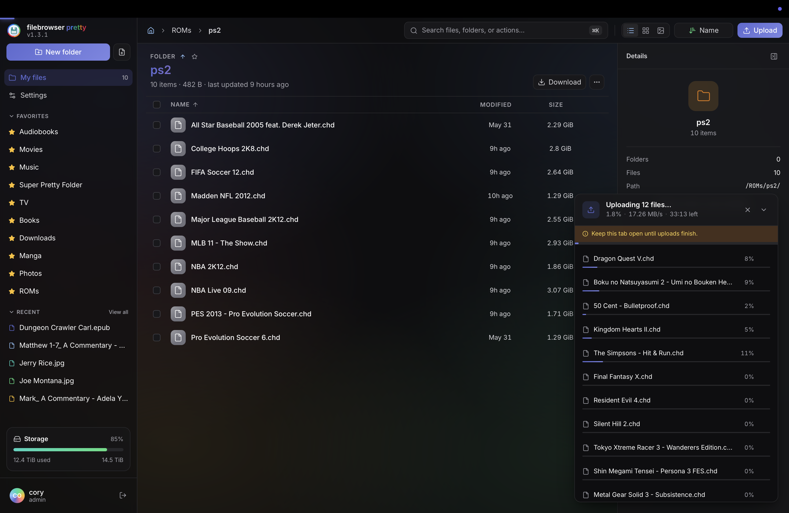
  <br/><em>Floating upload dock — per-file progress, cancel, and queueing</em>
</p>

### Personalization &amp; admin

<p align="center">
  
  <br/><em>Per-user settings — theme, background gradient, and translucent surfaces</em>
</p>

<p align="center">
  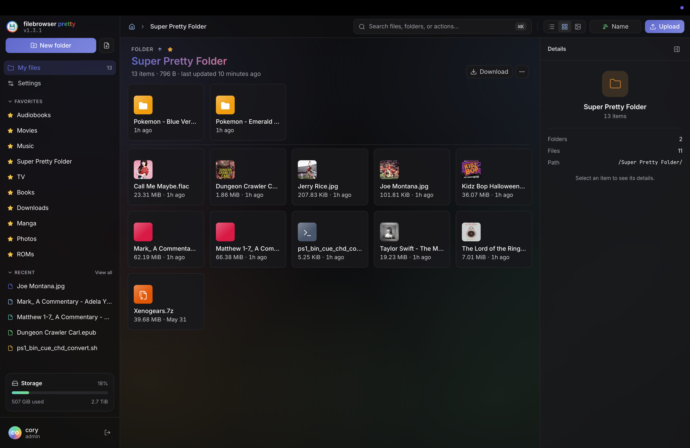
  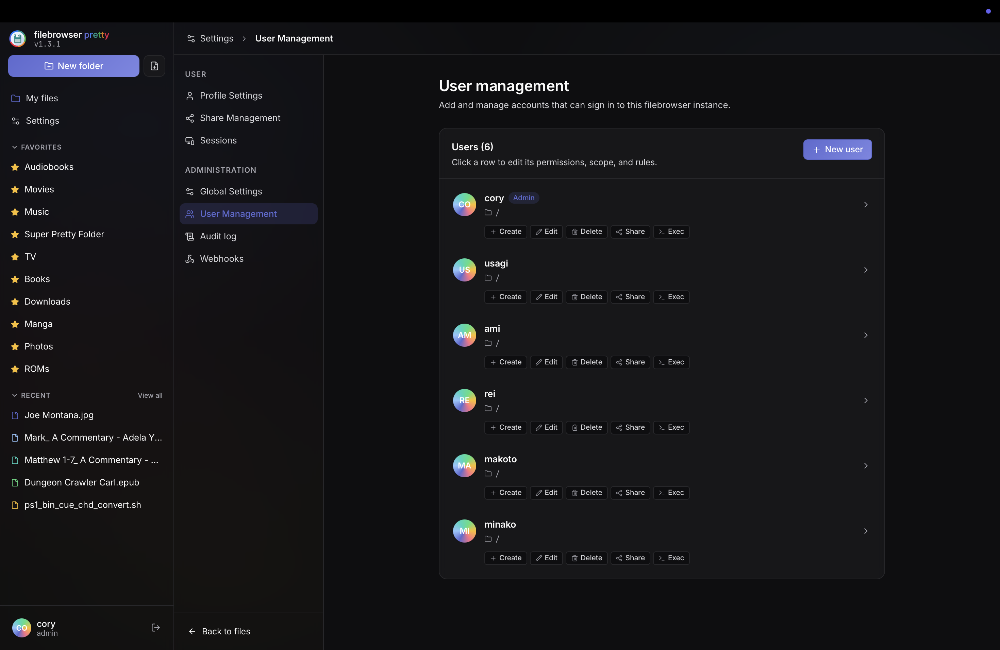
  <br/><em>Favorites with custom display titles · admin user management</em>
</p>

<p align="center">
  
  <br/><em>Login — the full six-color gradient backdrop</em>
</p>

### Mobile

<p align="center">
  
  
  
  <br/><em>Responsive on every screen — slide-out sidebar, pull-to-refresh, swipe between files</em>
</p>

---

The published image lives at **`ghcr.io/csummers-dev/filebrowser-pretty:latest`** and works on any Linux x86_64 host (NAS, mini-PC, VPS, homelab).

### Docker Compose

```yaml
services:
  filebrowser:
    image: ghcr.io/csummers-dev/filebrowser-pretty:latest
    container_name: filebrowser-pretty
    restart: unless-stopped
    user: "1000:1000"        # match the UID/GID that owns your storage dirs
    ports:
      - "8080:80"
    volumes:
      # Your real data — mount user-owned SUBDIRECTORIES,
      # not whole NAS volume roots (those are owned by root and you'll hit
      # 403s on uploads).
      - /path/to/your/movies:/srv/Movies
      - /path/to/your/music:/srv/Music
      - /path/to/your/downloads:/srv/Downloads
      # Filebrowser's own state — keep on a fast disk if you have one
      - ./filebrowser/database:/database
      - ./filebrowser/config:/config
    environment:
      TZ: America/Los_Angeles
    healthcheck:
      test: ["CMD", "/healthcheck.sh"]
      interval: 30s
      timeout: 5s
      retries: 3
```

Behind a reverse proxy (Traefik shown here — adapt for Caddy / nginx / your stack):

```yaml
    networks: [web]
    labels:
      - traefik.enable=true
      - traefik.docker.network=web
      - traefik.http.routers.filebrowser-pretty.rule=Host(`files.yourdomain.com`)
      - traefik.http.routers.filebrowser-pretty.entrypoints=websecure
      - traefik.http.routers.filebrowser-pretty.tls.certresolver=letsencrypt
      - traefik.http.services.filebrowser-pretty.loadbalancer.server.port=80
```

Then:

```bash
docker compose up -d filebrowser
docker compose logs filebrowser | grep "password for"
```

Or skip Docker entirely and run the binary directly: `./filebrowser` — opens on <http://localhost:8080>.

## Architecture

```
Browser  —  Vue 3 · TypeScript · Pinia · Tailwind v4
  • Composition API + composables (shortcuts, drag, focus, theme)
  • Format viewers — pdf.js · video.js · epub.js · Ace · music-metadata · exifr
  • Virtual scrolling · service-worker offline shell

        │  HTTP / WebSocket
        ▼

Go backend  —  Gorilla mux · JWT auth · afero filesystem
  • Storm/BoltDB — users · shares · settings
  • In-process event bus → audit log + webhooks (BoltDB siblings)
  • Tags · disk cache · resumable uploads (TUS) · ffmpeg thumbnails
  • Frontend assets embedded — deploys as a single binary
```

### Tech stack

| Layer | Choice |
| --- | --- |
| Backend | **Go 1.25** |
| DB | **Storm/BoltDB** |
| Frontend | **Vue 3 + TypeScript** |
| State | **Pinia** |
| Styling | **Tailwind v4** |
| Build | **Vite + Rolldown** |
| Routing | **vue-router 5** |
| i18n | **vue-i18n** |
| Uploads | **TUS (tus-js-client)** |
| Virtual list | **vue-virtual-scroller** |
| PDF | **pdfjs-dist 6** |
| Video | **video.js 8** + **ffmpeg** thumbnails |
| Audio | **music-metadata 11** |
| EPUB | **vue-reader + epub.js** |
| Code | **Ace 1.44** |
| Markdown | **marked + KaTeX** |
| EXIF | **exifr 7** |

---

### v1.3.0 — Tags, scale, and admin tooling

- **Tags & smart folders** — per-file color-coded tags with inline chips and a picker, plus saved-search "smart folders" over a compound `tag:` / `type:` / `name:` query syntax. Tags follow files through renames and moves
- **Right-click context menus** — on file rows and empty listing space, with keyboard navigation and type-ahead
- **Bulk rename** — pattern and find-and-replace modes in a slide-over, with live preview and conflict highlighting
- **Drag-select lasso** — rubber-band selection in grid and gallery; a drag ghost shows what's being moved; spring-loaded folders open on hover
- **Preview enhancements** — PDF text search with highlights; rendered Markdown (toggle to raw); an image film strip and basic editing (rotate / flip / crop, saved as a copy); EPUB chapter list and remembered reading position; subtitle upload and picture-in-picture for video; size-capped image hover-preview in the listing
- **Virtual scrolling** — the list view stays smooth in folders with tens of thousands of files
- **Server-side video thumbnails** — ffmpeg-generated poster frames, bundled in the Docker image, with a clean fall back to the generic icon when ffmpeg isn't present
- **Resumable uploads** — uploads survive a dropped connection and resume from where they left off; per-file cancel / remove in the dock; smarter retry handling
- **Offline app shell** — the interface loads without a connection, with an "offline" indicator and clear, named error states (server unreachable / permission denied / not found) with one-click retry
- **Mobile gestures** — pull-to-refresh, camera-roll / photo upload, and swipe between files (plus swipe-down to close) in the preview
- **Audit log** — admin page recording file operations, shares, sign-ins, and settings changes, filterable by action / user / date / path
- **Webhooks** — POST a JSON payload to configured endpoints on file events, with per-endpoint event filters, a test button, last-delivery status, and retry with backoff
- **Session management** — "sign out everywhere" revokes every other session at once
- **Accent color** — six-preset picker that recolors the whole interface, synced per user
- **Power-user navigation** — recents and favorites in the sidebar, per-folder view-mode memory, multi-column sort (including by extension), breadcrumb depth-ellipsis with a sibling-folder dropdown, and command-palette recents

### v1.2.1 — Keyboard + search + preview

- **Keyboard shortcuts I expected to already exist** — `Cmd+A` / `Ctrl+A` select all in the listing (with a proper input-focus guard so it doesn't hijack the search bar's native select-all), `r` to refresh the current folder, `j` / `k` for previous / next track inside the audio preview, `PageUp` / `PageDown` / `Home` / `End` for page navigation inside the PDF preview
- **Copy path action** — small button next to the Location label in the details sidebar. Copies the relative path to the clipboard, flashes "Copied" inline, and surfaces a toast. Falls back to `execCommand("copy")` on HTTP-only homelab deployments where the modern clipboard API isn't available
- **Searching… indicator in the command palette** — the palette no longer looks empty during the debounce + fetch window. A small accent-tinted spinner row appears as soon as the user types ≥ 2 characters and clears when the search resolves
- **Spring-load on breadcrumbs and section title** — extending the spring-loaded folders pattern from row drops to header navigation: hovering a breadcrumb segment during a drag for 2 s navigates to that folder; hovering the section title navigates to the parent folder. Drop still wins over the timer
- **Command palette no-results bug** — backend search results were being silently filtered out by a client-side fuzzy-score pass over the basename. Now the file group bypasses the fuzzy filter and trusts what the backend returned; static commands still go through scoring as before
- **Mobile multi-select pill styling** — the `#file-selection` row that shows up on narrow viewports had no CSS at all (legacy `.action` class with dead tokens). Now a proper toolbar — surface background, border-bottom, 36 px rounded tap targets, destructive-tinted Delete hover
- **Audio preview reliability** — fixed a temporal-dead-zone bug where `AudioViewer`'s `immediate: true` watch fired before its helper functions were initialized. Audio previews work again
- **Theme default is explicit System** — first-init writes `"system"` to localStorage immediately, instead of just falling back to it in memory. Visible in DevTools and consistent across tabs from the moment the user loads the app
- **Text-preview Edit button styling** — `.preview-toolbar-format__btn` was referenced in markup but never defined in CSS, so the button rendered with browser defaults next to the styled soft-wrap toggle. Defined the class to match its sibling chrome
- **Vue Router deprecation cleanup** — converted both navigation guards from the legacy `next(value)` callback to the return-value pattern. Removes a stream of deprecation warnings from every navigation

### v1.2.0 — Audio + lazy-loaded viewers

- **Album artwork on the audio info-rail** — embedded APIC artwork (extracted client-side via music-metadata) now renders as a square tile at the top of the Track section, matching the chrome of the AudioViewer card itself
- **Audio preview reliability fix** — temporal-dead-zone bug in `AudioViewer.vue` where an `immediate: true` watch fired before its helper functions were initialized; surfaced as paired "watcher callback" + "setup function" errors and broke audio previews entirely. Resolved by reordering the declarations
- **Lazy-loaded format viewers** — `PdfViewer` / `VideoViewer` / `AudioViewer` / `EpubViewer` / `TextViewer` / `CsvViewer` now load on demand via `defineAsyncComponent` instead of bundling into the main chunk. Pulled ~1.7 MB of viewer code (pdfjs-dist, video.js, ace-builds, epub.js, music-metadata) out of first-load. Image previews stay statically loaded.
- **CI workflow hardening** — branch name fixed (`master` → `main`), upstream-only release + docs deploy jobs trimmed, `lint-pr.yaml` removed
- **Docs polish** — Docker section in the README replaced with the real cross-compile + buildx + GHCR flow

### v1.1.1 — Surface polish

- **Upload dock redesign** — the floating progress card got a ground-up restyle: design-system tokens, live aggregate bar at the bottom edge of the head, per-file rows, dark mode, mobile full-width layout, completion checkmark, reduced-motion respect
- **Inline rename for the current folder** — new "Rename folder" action in the section-title ⋯ menu; swaps the h1 for an input with the same Enter/Esc/blur UX as inline row rename
- **Avatar tinted accent** — the user-row gradient now matches the brand mark (lilac) instead of the legacy emerald
- **Removed dead UI** — stripped the no-op More (⋯) button from the preview header
- **Tightened deploy docs** — Docker section in the README now matches the actual cross-compile + buildx flow

### v1.1.0 — Drag, preview, polish

- **Spring-loaded folders** — hover-to-open on drag, 2 s with a clockwise progress ring
- **Breadcrumb drop targets** — drag-to-parent (or any ancestor) without leaving the folder
- **Rich preview metadata** — EXIF for photos, ID3 for audio (with APIC artwork), track info for video, full PDF.js chrome
- **EPUB dark mode that actually works** — `themes.override` with the priority flag so the book's own CSS doesn't win specificity
- **Cross-format arrow nav** — `←` / `→` reliably step between previewable files even from inside EPUB iframes and PDF.js viewers
- **Zip extract with delete-original** — server-side extraction, with an optional "remove the archive after success" toggle
- **Shared drag composable** (`useDropTarget`) — single source of truth for move-vs-copy, conflict resolution, and error toasts

### v1.0

- Grid + Gallery views, multi-select pill, responsive sweep
- Command palette + search
- Inline file operations
- Slide-overs, settings rebuild, user admin
- Login + share-view rewrites
- A11y, dark mode, mobile, keyboard, polish
- Preview rebuild: All seven format viewers
- Build pipeline, prettier sweep, dead code, Docker

---

## Credits

This project began as a fork of [filebrowser/filebrowser](https://github.com/filebrowser/filebrowser) by [@hacdias](https://github.com/hacdias) and the original maintainers.

---

## License

Apache License 2.0. See [LICENSE](LICENSE).

---

<div align="center">

**Built with love by csummers-dev.**

</div>
